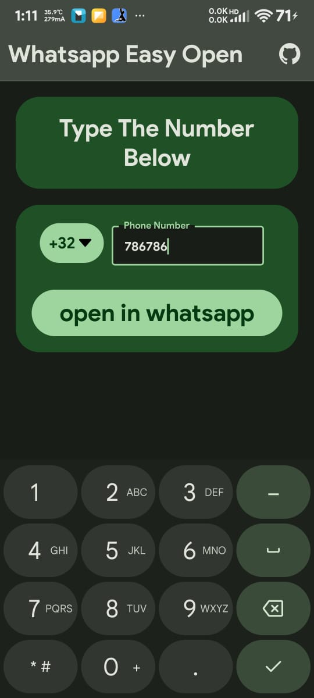

# Whatsapp contact Opener



### This is a material you based Android App which opens a given number directly in whatsapp without having to save the number
## Build Steps

1. clone this repo

   ```bash
   git clone https://github.com/zaved707/whatsapp_contact_opener.git
   ```
2. go to project directory do npm install

   ```bash
   cd Crops_info
   ```
3. then do npm expo start

   ```bash
   npx expo start
   ```
4. and use the expo go app from the play store to run.

## To Make apk

[Use EAS](https://docs.expo.dev/build/setup/) to build apk

if you want to build apk locally its a little tricky , you should check expo website for directions.
